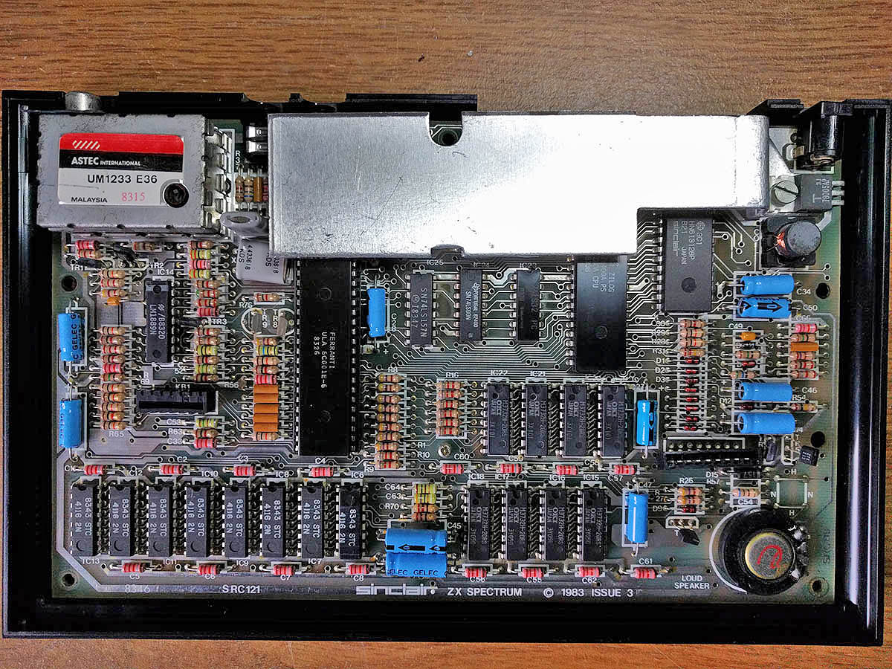
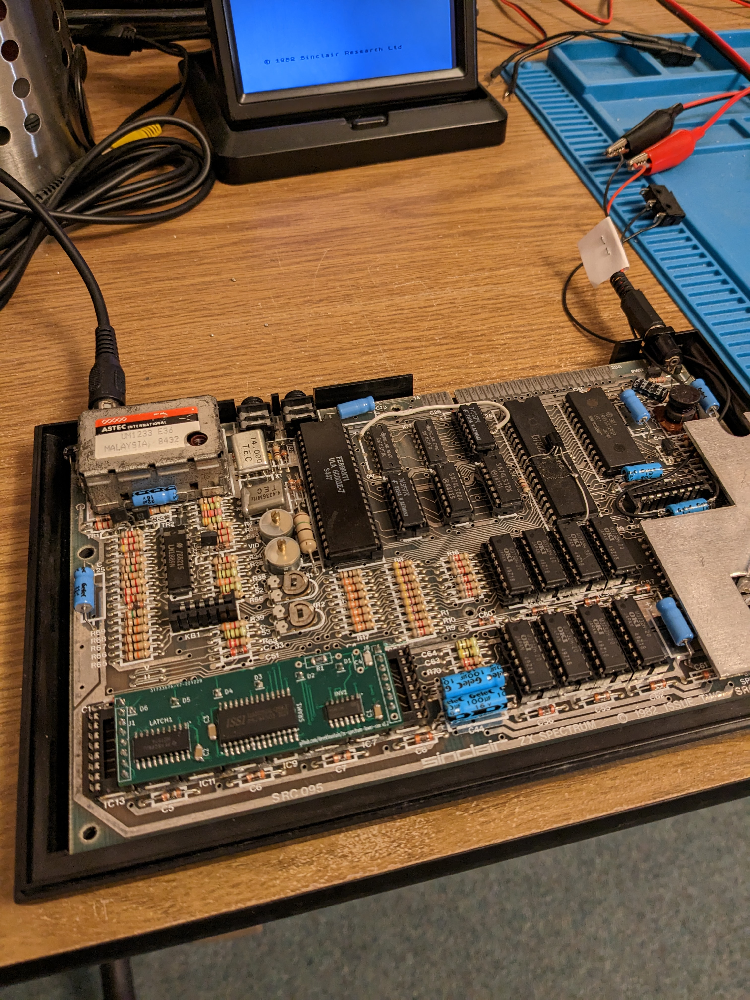
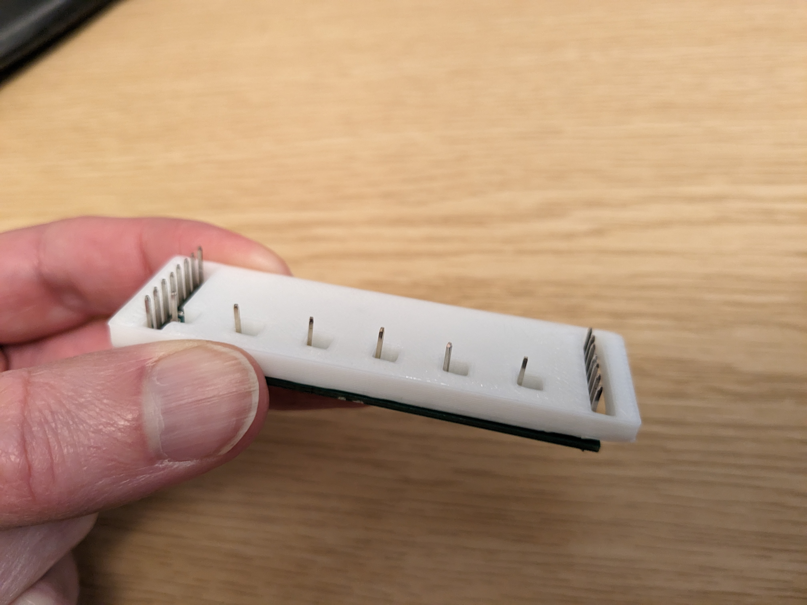
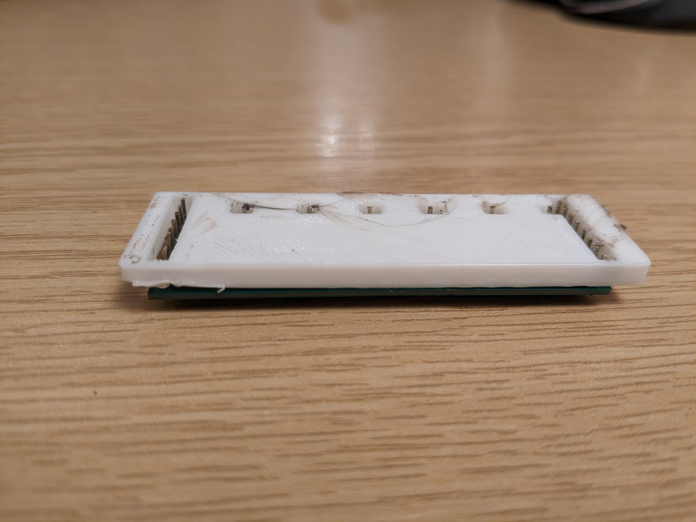

# zx-spectrum-lower-ram

## A lower RAM module for the ZX Spectrum

This is a hardware module which implements the lower 16K RAM bank for a
16K or 48K ZX Spectrum microcomputer.

The memory bank is normally implemented with 8 4116 DRAM ICs. These
ICs are no longer in production, and although not yet hard to get hold
of, the ones which are available are 50 years old and have inevitable
frailties. This project implements the required 16K of memory using a
modern SRAM IC.

The project is a plug in replacement, replacing this:

with this:

(And yes, that's a different Spectrum in those 2 photos. :))

At the time of implemention, there was no open source design for this type
of memory board. Hence I created one.

## Design

The Spectrum uses a multiplexed address system common of low cost micros of
the 70s and 80s. It addresses the memory ICs twice, first with a 7-bit row
address ("RAS") value, then about 50ns later with a 7-bit column address
("CAS") value. That's how the 4116 ICs work. The advange to those ICs is
that it only requires 7 address lines, rather than the 14 which would
otherwise be required to address 16K.

None of that is required any more and modern RAM ICs have all the address
lines they require. The modern design is therefore to use a latch triggered on the row
address strobe (RAS) to store the first 7 bits of the address, then pass those and
the other 7 bits of the address into the address lines of a modern
SRAM IC when the CAS signal arrives. It turns out that the SRAM will remove
its data from its output bus slightly too soon for the Spectrum's ULA, so
a small timer circuit is needed to slow the CAS signal down a few nanoseconds.

16K SRAMs are difficult to get hold of these days, and tend to be rather
expensive. This project uses a 32K SRAM and ignores the top 16K of it.

I've only tested the design with the Ferranti 6C001E-6 and Ferranti 6C001E-7
ULAs. It's possible some timing tweaks might be required for other ULAs.

## KiCAD Project

The project is implemented in KiCAD v6. It's in the slrm/ directory. ((S)pectrum
(L)ower ( R)AM (M)odule.)

There are a couple of snapshots of early implementations of the project. One of
these is a "breakout" version of the board which might be useful to
investigate signals using a 'scope.

## Fabrication

The Gerber files which can be sent directly for fabrication are to be found
in slrm/fab1.2/fab1.2.zip. You can just upload that ZIP to JLCPCB (which is
what I did). Default values for JLCPCB's fabrication process
will do fine except for the board thickness. Set that to 1.00mm. It's very
tight under the Spectrum's keyboard.

## Bill of Materials

1x [IS62C256AL-25ULI-TR 32K SRAM](https://www.mouser.co.uk/ProductDetail/870-62C256AL-25ULIT)
32K SRAM IC
 
1x [74HCT574](https://www.mouser.co.uk/ProductDetail/595-SN74HCT574NSR)
8 bit flip flop latch
 
1x [74HCT04](https://www.mouser.co.uk/ProductDetail/863-MC74HCT04ADG)
6 circuit inverter
 
3x [3216 SMD 0.1uF capacitor](https://www.mouser.co.uk/ProductDetail/581-12065C104KAT4A)
Capacitor
 
1x [3216 68R SMD resistor](https://www.mouser.co.uk/ProductDetail/603-RT1206FRE0768RL)
Resistor
 
1x [3216 SMD 100pF capacitor](https://www.mouser.co.uk/ProductDetail/581-12065A101J)
Capacitor
 
22x Arduino type 2.54mm Pin header connectors

## Assembly

Any 62256-standard SRAM IC should work. The ISSI one I chose was the cheapest
at Mouser. The [Alliance Memory](https://www.mouser.co.uk/ProductDetail/913-CY62256NLL55SNXI)
one should be fine as well. Solder the SRAM first, then do the latch and the inverter, then
their decoupling capacitors. Then do the resistor and capacitor for the timer circuit.
Through the hole footprints are also available for these last two components, but they make
the keyboard refit extremely tight. They work, but use SMD if you can.

## Pin Length

The pins need to protrude below the board and fit into the sockets (or PCB if you're
soldering directly), but they mustn't be any longer than absolutely necessary
otherwise the board will stand too proud on the Spectrum PCB and the keyboard won't
fit back on.

The correct length for all the boards I've made up is 4.2mm protruding. This is very
difficult to get accurate and consistent with cutters, so I made a 3D printed jig.
That's in the slrm/3D directory, both as an SCAD source file and a STL file. If you
take this route, place the jig over the pins:

then use a rotary tool or similar to grind the pins to the correct length:

## Fitting

Once assembled, and with the pins the right length, the board then just presses into
the sockets on the Spectrum PCB:

Note the fitting: the board doesn't span the entire width of the 8 4116 ICs. The outer
most sides of the two end sockets aren't used.

[Derek Fountain](https://www.derekfountain.org/), January 2023