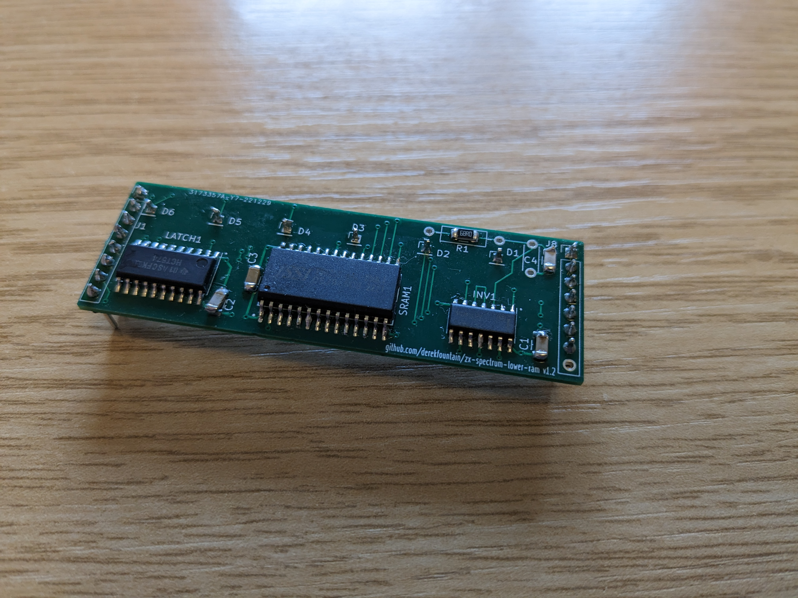
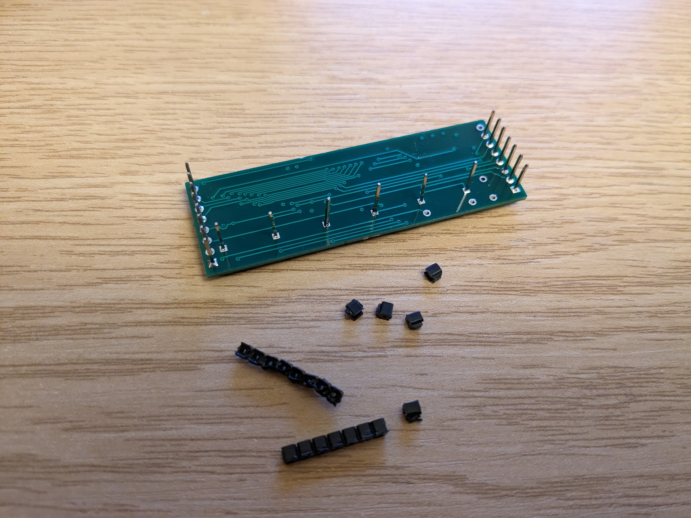
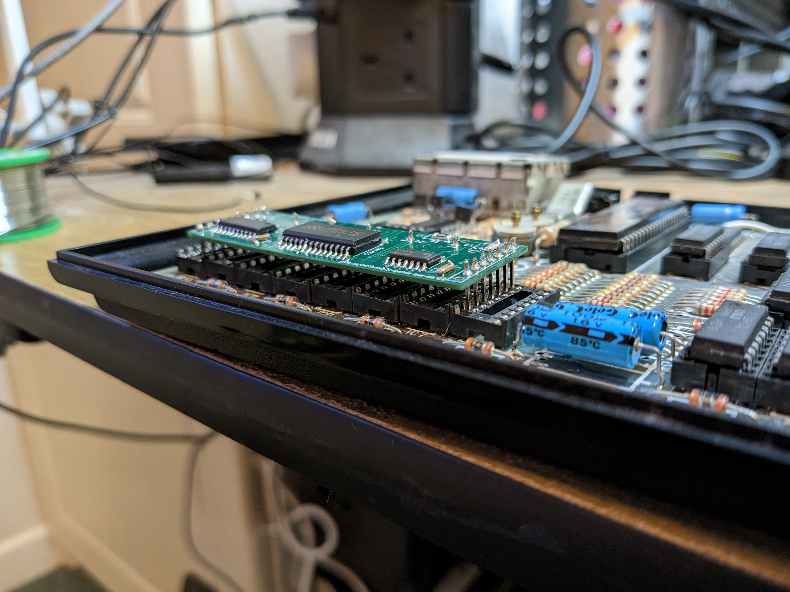
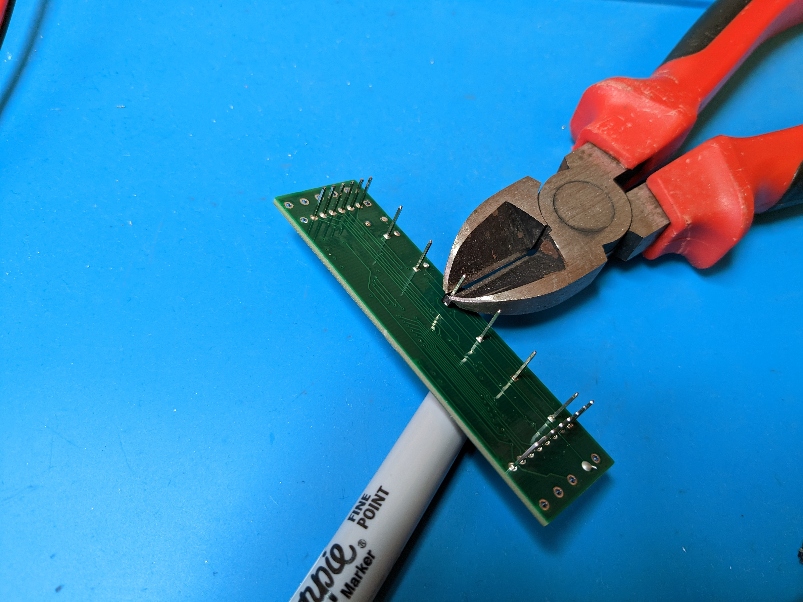
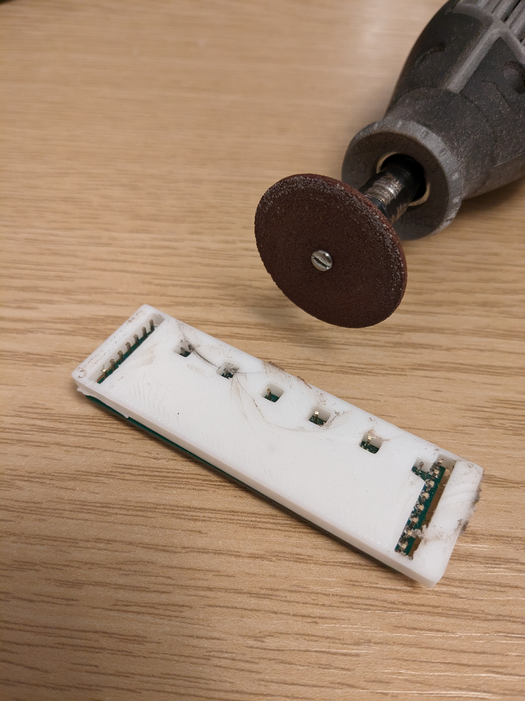
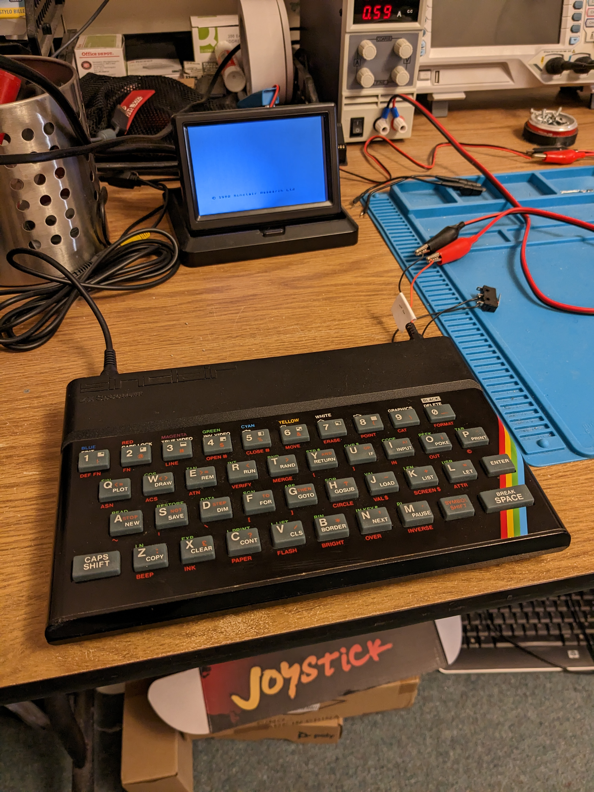

# zx-spectrum-lower-ram

## A lower RAM module for the ZX Spectrum

The ZX Spectrum home computer from the 1980s has two banks of RAM. The "lower"
RAM is the 16K of DRAM which makes up the address range 0x4000 to 0x7FFF. The
8 4116 ICs are in the bottom left of the circuit board, as seen here:

These memory ICs are notorious for failing when the Spectrum's internal
DC-DC converter fails, which it tends to do rather easily. The ICs haven't
been made for a long time, so the options for a modern repair are old
stock or a modern replacement.

Modern replacement boards are available, but when I wanted one I found there
are no working, open designs to build yourself. So I created this one.

## Design

There are several of these boards available, and they all work the same way.
The Spectrum uses a multiplexed address system common of low cost micros of
the 70s and 80s. It addresses the memory ICs twice, first with a 7-bit row
address ("RAS") value, then about 50ns later with a 7-bit column address
("CAS")value. That's how the 4116 ICs work. The advange is that it only
requires 7 address lines, rather than the 14 which would otherwise be
required to address 16K.

None of that is required any more and modern RAM ICs have all the address
lines they require. The modern design is to use a latch triggered on the row
address value to store the first 7 bits of the address, then pass those and
the other 7 bits bits of the address into the address lines of a modern
SRAM IC.

So, an 8-bit latch triggered on RAS to grab the lower part of the address,
the result of which is fed, along with the upper part of the address, into
an SRAM on CAS. The output byte of the SRAM is placed directly onto the
Spectrum's data bus, one bit of which is supplied by each of the 4116 IC
sockets.

## v1.0

v1.0 of the board worked, but it produced what I termed "sparkles" on the
screen. It's not a great photo, but they can be seen here:

Flickering artefacts, presumably caused by random values in the screen
memory.

It turns out these are produced by the Spectrum's ULA when the timing isn't
quite right. The Z80 is less fussy and worked fine with the v1.0 board. In
order to get the ULA happy I needed to hack on a little timing circuit:

The variable resistor seen there allowed me to tune the timing and get the
value right.

## v1.1

That timing circuit made it onto v1.1 of the board, which is a working
prototype:

I also created a "breakout" version of this board which allows easier
connection of probes and bodges:

Obviously the Spectrum's lid (i.e. keyboard) doesn't fit with one in place.

## v1.2

The prototype worked. No sparkles. Hurrah! At least with the one Spectrum
and ULA I tried it with.

I tidied up the design and sent v1.2 off to JLCPCB for fabrication. It
came back looking like this:

That's a 1.00mm board, and you can see I've lost the test points in order
to make the board smaller. There's not a lot of room under the Spectrum's
keyboard so it needs to be as compact as possible.

### Trimming the pins

The mechanical aspect of this design is quite interesting. I used Arduino
style header pins for the connection to the Spectrum. They're 11mm
which is too long, they make the board stand far too tall:

For an early version of the board I tried clipping them with cutters.

It didn't really work. They're very hard and hefty cutters are required, and
those bend the cut tips of the headers. It's also very hard to keep them an
even length. By the time I'd finished at least one pin was too short and the
board didn't work any more.

Change of plan. I decided to use a Dremel to cut the pins, and in order to
get the length exactly right and consistent I created a 3D printed jig:

This took all day but made running the Dremel over the pins very simple:

The result is exactly as required:

The board works, and it fits!

